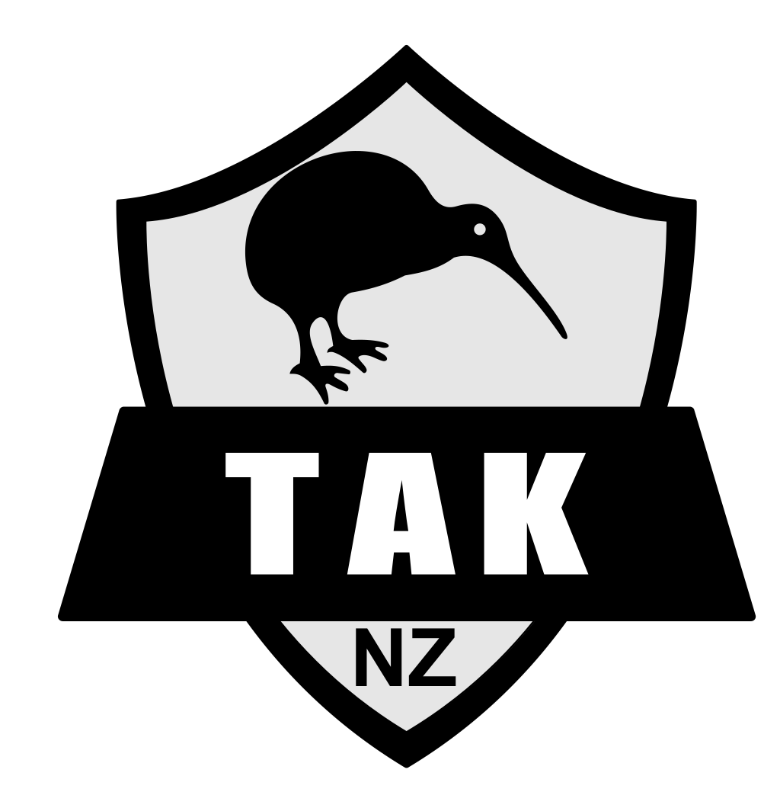

<h1 align=center>CloudTAK</h1>

Full Featured in-browser TAK Client

&

Facilitate ETL operations to bring non-TAK data sources into a TAK Server

    

## Documentation

Deployment, local development, and administration guidance now live in the CloudTAK documentation site so the repo root is not a second source of truth.

- Deployment: https://docs.cloudtak.io/deploy/
- Local development: https://docs.cloudtak.io/develop/
- Administration: https://docs.cloudtak.io/admin/

> [!NOTE]
> Local development and Docker Compose expose the core map experience, but a full AWS deployment is still required for the complete optional ETL infrastructure.

