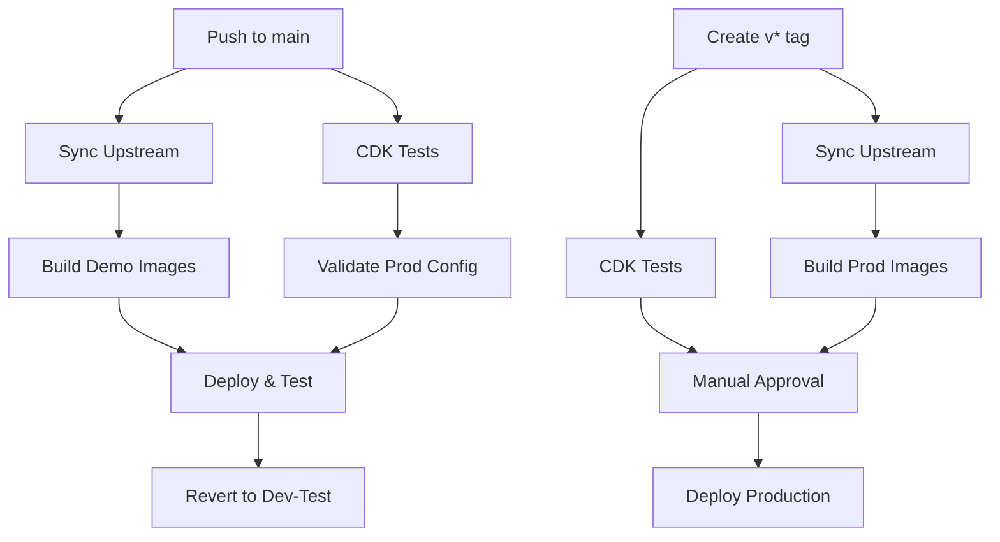

# AWS GitHub Actions Setup for CloudTAK

This guide covers setting up GitHub Actions for the CloudTAK repository, building on the base infrastructure already configured in BaseInfra.

## Prerequisites

**⚠️ Important:** Steps 1-2 from the [BaseInfra AWS GitHub Setup](https://github.com/TAK-NZ/base-infra/blob/main/docs/AWS_GITHUB_SETUP.md) must be completed first:
- Route 53 DNS setup
- GitHub OIDC Identity Provider and IAM roles

## 3. GitHub Environment Setup for CloudTAK

### 3.1 Create Environments

In your CloudTAK GitHub repository, go to **Settings → Environments** and create:

1. **`production`** environment
   - **Protection rules:**
     - Required reviewers: Add team leads
     - Wait timer: 5 minutes
     - Deployment branches and tags: Select "Selected branches and tags"
       - Add rule: "v*" (for version tags like v1.0.0)

2. **`demo`** environment
   - **Protection rules:**
     - Deployment branches and tags: Select "Selected branches and tags"
       - Add rule: "main"
   - **Environment variables:**
     - `DEMO_TEST_DURATION`: `300` (wait time in seconds, default 5 minutes)
     - `STACK_NAME`: `Demo`

### 3.2 Configure Environment Secrets

**For `production` environment:**
- `AWS_ACCOUNT_ID`: `111111111111`
- `AWS_ROLE_ARN`: `arn:aws:iam::111111111111:role/GitHubActions-TAK-Role`
- `AWS_REGION`: `ap-southeast-6`

**For `demo` environment:**
- `AWS_ACCOUNT_ID`: `222222222222`
- `AWS_ROLE_ARN`: `arn:aws:iam::222222222222:role/GitHubActions-TAK-Role`
- `AWS_REGION`: `ap-southeast-2`

## 4. GitHub Actions Workflows

### 4.1 Workflow Architecture



### 4.2 Demo Testing Workflow (`demo-deploy.yml`)

**Triggers:**
- Push to `main` branch
- Manual dispatch

**Jobs:**
1. **test**: Run CDK unit tests and linting
2. **build-images**: Sync upstream, apply branding, build CloudTAK images
3. **validate-prod**: Validate production configuration
4. **deploy-and-test**: Deploy with prod profile and run tests
5. **revert-to-dev-test**: Always revert to dev-test configuration

### 4.3 Production Deployment Workflow (`production-deploy.yml`)

**Triggers:**
- Version tags (`v*`)
- Manual dispatch

**Jobs:**
1. **test**: Run CDK unit tests
2. **build-images**: Sync upstream, apply branding, build production images
3. **deploy-production**: Deploy to production with built images (requires approval)

### 4.4 Weekly Upstream Sync (`weekly-sync.yml`)

**Triggers:**
- Schedule: Monday 2AM UTC
- Manual dispatch

**Process:**
1. Sync with upstream CloudTAK repository
2. Apply TAK.NZ branding
3. Create pull request for review

## 5. Required Secrets and Variables

**Environment Secrets (per environment):**

| Secret | Description | Example |
|--------|-------------|---------|
| `AWS_ACCOUNT_ID` | AWS account ID | `123456789012` |
| `AWS_ROLE_ARN` | GitHub Actions IAM role ARN | `arn:aws:iam::123456789012:role/GitHubActions-TAK-Role` |
| `AWS_REGION` | AWS deployment region | `ap-southeast-2` |

**Environment Variables:**

| Variable | Environment | Description | Example | Required |
|----------|-------------|-------------|---------|----------|
| `STACK_NAME` | demo, prod | Stack name suffix | `Demo`, `Prod` | ✅ |
| `DEMO_TEST_DURATION` | demo | Test wait time in seconds | `300` | ❌ |

**Repository Variables:**

| Variable | Description | Default | Usage |
|----------|-------------|---------|-------|
| `ENABLE_WEEKLY_SYNC` | Enable/disable weekly upstream sync | `true` | Set to `false` to temporarily disable weekly sync |

## 6. Verification

Test the CloudTAK setup:

1. **Demo Testing:** Push to `main` branch → Should sync upstream → Build images → Deploy demo → Test → Revert
2. **Production:** Create and push version tag:
   ```bash
   git tag v1.0.0
   git push origin v1.0.0
   ```
   → Should require approval → Deploy after approval

## 7. Troubleshooting

### 7.1 Common Issues

| Issue | Symptoms | Solution |
|-------|----------|----------|
| **Upstream Sync Fails** | Merge conflicts in sync | Manually resolve conflicts and create PR |
| **Missing ECR Repository** | Docker push fails | Verify BaseInfra stack is deployed |
| **Image Build Fails** | Docker build errors | Check upstream changes and branding compatibility |
| **CDK Synthesis Fails** | `cdk synth` command fails | Verify cdk.json context values |

### 7.2 CloudTAK Specific Issues

**Common CloudTAK Problems:**

- **Upstream Conflicts:** Resolve conflicts between upstream changes and TAK.NZ customizations
- **Branding Issues:** Verify branding files exist and are compatible with upstream changes
- **API Changes:** Check for breaking changes in upstream API that affect ETL tasks
- **Database Schema:** Verify database migrations are compatible with upstream changes